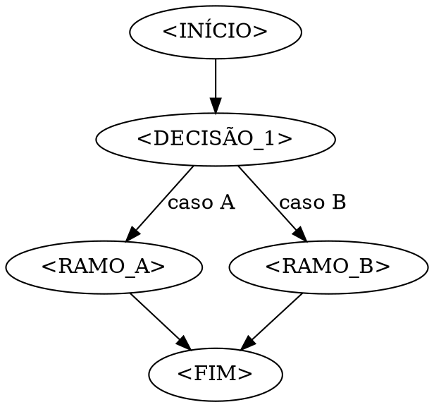

# AI_BEST_PRACTICES

> Boas práticas para adotar Claude Code (Anthropic) em projetos, tratando os
> **artefatos de IA** (CLAUDE.md, skills, hooks, sub-agents, comandos, scripts
> auto-incrementais) como **infraestrutura versionada** — com a mesma disciplina
> de ownership, review e atualização de um pipeline de CI.
>
> Princípio-mãe: *a IA adapta-se ao seu projeto, não o contrário.* Cada artefato
> existe para reduzir fricção e preservar contexto entre sessões — que, por
> padrão, começam do zero.

## How it's going

| Campo | Valor |
|---|---|
| **Versão** | 2.0 |
| **Última revisão** | 2026-05-28 |
| **Próxima revisão sugerida** | 2026-11-28 (semestral) |
| **Audiência** | Engenheiros adotando Claude Code em projetos (Python/Django, Vue, e os repos beemon: SABT/SNPB, midas, dashboard) |
| **Escopo** | Padrões repo-level e práticas de equipe. Não cobre customização do CLI nem extensões do VSCode. |
| **Idioma** | Documento em português; código, identificadores e templates em inglês (alinhado com a regra de inglês como idioma oficial do codebase). |
| **Como contribuir** | Revisão semestral; mudanças pontuais por edit direto + bump no [Apêndice C](#apêndice-c--histórico-de-revisões). |

### Status por capítulo

| # | Capítulo | Status |
|---|----------|--------|
| 1 | Modelo mental: camadas de artefato | Estável |
| 2 | CLAUDE.md em camadas | Estável |
| 3 | Hooks como guardrails | Estável |
| 4 | Slash commands como runbooks | Estável |
| 5 | Sub-agents especialistas | Estável |
| 6 | Skills compostas | Em evolução |
| 7 | Plan-mode versionado | Estável |
| 8 | Memória auto-mantida | Em evolução |
| 9 | Princípios de planning | Estável |
| 10 | Automação auto-incremental | Estável |
| 11 | Oportunidades futuras e evolução | Experimental |

---

## 0. Como usar este documento

**Começando do zero num projeto novo:** leia o [Apêndice A](#apêndice-a--checklist-de-adoção-por-fase) — mapeia capítulos por fase (Dia 0 → Mês 3) para não adotar tudo de uma vez.

**Entender um padrão específico:** pule direto para o capítulo. Cada um é autocontido — `Problema → Princípio → Quando aplicar → Anti-padrões → Template → Case study → Checklist`.

**Auditando um repo que já adotou:** use o "Checklist de adoção" no fim de cada capítulo como gate de revisão.

**Para onde isso vai:** [Capítulo 11](#11-oportunidades-futuras-e-evolução) sinaliza o que monitorar, experimentar e evitar.

### As três lentes: Criar → Preservar → Automatizar

Os capítulos se agrupam em três movimentos do ciclo de vida de um artefato:

- **CRIAR** — produzir o artefato certo, no lugar certo (caps. [1](#1-modelo-mental-camadas-de-artefato)–[7](#7-plan-mode-versionado), [9](#9-princípios-de-planning)).
- **PRESERVAR** — manter contexto e memória sãos ao longo do tempo (cap. [8](#8-memória-auto-mantida)).
- **AUTOMATIZAR** — fazer o ambiente crescer e se manter sozinho (caps. [3](#3-hooks-como-guardrails), [10](#10-automação-auto-incremental)).

### Convenções

- **🔮** indica projeção fundamentada, não doutrina.
- **Template genérico** usa `<PLACEHOLDERS_ASSIM>` para campos que o adotante substitui.
- **Case study** linka artefatos reais como referência viva — opcionais, não load-bearing.
- **Status:** `Estável` (produção), `Em evolução` (use com gate), `Experimental` (piloto só).

---

## 📑 Índice

1. [Modelo mental: camadas de artefato](#1-modelo-mental-camadas-de-artefato)
2. [CLAUDE.md em camadas](#2-claudemd-em-camadas)
3. [Hooks como guardrails](#3-hooks-como-guardrails)
4. [Slash commands como runbooks](#4-slash-commands-como-runbooks)
5. [Sub-agents especialistas](#5-sub-agents-especialistas)
6. [Skills compostas](#6-skills-compostas)
7. [Plan-mode versionado](#7-plan-mode-versionado)
8. [Memória auto-mantida](#8-memória-auto-mantida)
9. [Princípios de planning](#9-princípios-de-planning)
10. [Automação auto-incremental](#10-automação-auto-incremental)
11. [Oportunidades futuras e evolução](#11-oportunidades-futuras-e-evolução)

**Apêndices:** [A — Checklist por fase](#apêndice-a--checklist-de-adoção-por-fase) · [B — Glossário](#apêndice-b--glossário) · [C — Histórico de revisões](#apêndice-c--histórico-de-revisões) · [D — Referências externas](#apêndice-d--referências-externas) · [E — Checklist operacional consolidado](#apêndice-e--checklist-operacional-consolidado)

---

## 1. Modelo mental: camadas de artefato

> **Status:** Estável · **TL;DR:** quatro camadas de artefato, cada uma com
> persistência e propósito diferentes. Saber em qual camada uma instrução vive é a
> decisão mais barata que evita o maior desperdício.

### Princípio

| Camada | Artefato | Quando carrega | Para quê |
|---|---|---|---|
| 1. Regras estáticas | `CLAUDE.md` | sempre, no início da sessão | verdades não-negociáveis do projeto |
| 2. Memória aprendida | `MEMORY.md` (auto memory) | início da sessão (~200 linhas / 25KB) | padrões que o Claude inferiu sozinho |
| 3. Procedimentos | Skills (`SKILL.md`) | sob demanda, quando invocados | workflows reutilizáveis com julgamento |
| 4. Automação | Hooks (`settings.json`) | em eventos do ciclo de vida | ações determinísticas, zero-variância |

Cada capítulo seguinte aprofunda uma dessas camadas (ou um artefato derivado:
sub-agents, slash commands, plans).

### Teste prático: onde colocar uma instrução

- Precisa ser verdade em *todo* turno? → `CLAUDE.md` ([cap. 2](#2-claudemd-em-camadas))
- Procedimento que você só usa *às vezes*? → Skill ([cap. 6](#6-skills-compostas))
- Script que deve rodar *automaticamente*? → Hook ([cap. 3](#3-hooks-como-guardrails))
- Julgamento dentro de limites → Skill; variância zero → Hook.
- Encheria o contexto principal? → delegue a um sub-agent ([cap. 5](#5-sub-agents-especialistas)).

### Anti-padrões

| Anti-padrão | Por quê é ruim |
|---|---|
| Procedimento on-demand no `CLAUDE.md` | Lido sempre, infla contexto inicial — devia ser skill |
| Regra inviolável só na memória | Memória é inferida e pode ser podada; regra dura vai no `CLAUDE.md` |
| Hook onde precisa de julgamento | Hook é zero-variância; julgamento quebra o determinismo |
| Mesma instrução em duas camadas | Duas fontes de verdade que divergem |

### Checklist de adoção

- [ ] Cada instrução recorrente mora em uma só camada
- [ ] `CLAUDE.md` só tem o que precisa ser verdade em todo turno
- [ ] Procedimentos ocasionais viraram skills, não seções da `CLAUDE.md`
- [ ] O que é determinístico virou hook, não prosa

---

## 2. CLAUDE.md em camadas

> **Status:** Estável · **TL;DR:** documente regras invioláveis na raiz e detalhes táticos por app/módulo/package — nunca duplique.

### Problema

`CLAUDE.md` é o primeiro arquivo que o Claude lê. Se você joga tudo nele — regras de negócio, convenções de schema, detalhes de cada subsistema, exemplos longos — três coisas pioram:

1. **Sinal afoga em ruído**: o agente precisa de 5 minutos de leitura para começar a trabalhar.
2. **Drift silencioso**: a seção de `billing/` evolui no código mas ninguém atualiza a CLAUDE.md raiz, e o agente passa a operar com instruções obsoletas.
3. **Acoplamento**: mudar uma regra de um subsistema exige editar um arquivo que todo mundo lê — política e convenção viram a mesma coisa.

### Princípio

Organize em **2-3 camadas**:

- **CLAUDE.md raiz** — regras invioláveis e ponteiros para os outros níveis. Curto (idealmente < 1500 linhas), estável, raramente editado.
- **`<app|package>/CLAUDE.md` por unidade** — detalhes táticos da unidade (convenções de modelos Django, regras de migration, query patterns, anti-padrões específicos). Editado pelo dono. Em Django, "unidade" = app; em monorepo uv/poetry = package; em projeto único = módulo grande com invariante própria.
- **(Opcional) `<submodule>/CLAUDE.md` per-submódulo** — só quando o submódulo tem invariantes próprias (e.g., um módulo `billing` com regras de ledger).

A raiz **referencia** as camadas inferiores; nunca duplica conteúdo delas.

### Dica de criação

- Use `/init` para gerar o esqueleto: o Claude analisa a estrutura e detecta convenções.
- Regra de tamanho: raiz < ~1500 linhas em setup com camadas; projeto single-app < ~200 linhas.
- Modularize regras grandes em `.claude/rules/` em vez de inchar o arquivo principal.

### Quando aplicar

- Repos Django/Flask com 4+ apps independentes (cada app tem suas próprias convenções).
- Monorepos Python (uv/poetry workspaces) com múltiplos packages.
- Codebases com convenções fortes que variam por subsistema (e.g., schema de migrations append-only vs source code Edit-friendly).
- Quando você notar que a CLAUDE.md raiz passou de ~1500-2000 linhas — sinal de extrair para camadas.

**Quando NÃO aplicar:** projeto single-app pequeno (até ~5k linhas). Só CLAUDE.md raiz basta — camadas viram overhead.

### Anti-padrões

| Anti-padrão | Por quê é ruim |
|---|---|
| Duplicar regra do package na raiz "para garantir que o agente vê" | Vira duas fontes de verdade que divergem |
| Instruções negativas vagas: "seja cuidadoso com X" | Não-verificável; agente não sabe quando aplicou |
| Regras sem comando de verificação | "siga convenção Y" sem `<command>` que prove conformidade vira religião |
| `CLAUDE.md` em diretório raramente tocado (e.g., `tooling/`) | Agente raramente lê; instruções ficam órfãs |

### Template genérico

`CLAUDE.md` raiz (estrutura mínima):

```markdown
# Coding Agent Guidelines

> Use este documento sempre que gerar ou editar código. Espelhe convenções existentes; não invente padrões novos sem motivo forte.

## 🚨 Mandatory: <PORTÕES_DE_MERGE>

> Cada portão é uma regra que bloqueia merge se violada. Liste os 3-6 mais importantes.

### Como aplicar
1. Identifique a área afetada.
2. Leia o doc/seção correspondente.
3. Aplique o padrão. Verifique com `<COMANDO>`.

## 🛠️ Slash Commands

> Cada portão acima tem um comando que o executa. Liste-os com link.

## Tecnologia

- <STACK_PRIMÁRIA> (ex: Django 5 + Python 3.12)
- <FERRAMENTAS> (ex: ruff, pytest, uv)

## Arquitetura

```
/
├── <app_1>/           # Django app ou pacote
├── <app_2>/
└── core/              # shared utilities
```

## 🧭 Planning Principles

> 5-10 princípios curtos, verificáveis, sobre como planejar tarefas neste repo.

## Core Coding Principles

### Idioma
<REGRA_DE_IDIOMA>

### Tipagem
<REGRAS_DE_TIPAGEM>

## Code Review Checklist

- [ ] <ITEM_VERIFICÁVEL_1>
- [ ] <ITEM_VERIFICÁVEL_2>
```

`<app|package>/CLAUDE.md` por unidade (estrutura mínima):

```markdown
# <App|Package> — Local Guide

> Detalhes táticos. A raiz referencia este arquivo; **não duplique** conteúdo daqui lá.

## Layout
<ESTRUTURA_DE_DIRETÓRIOS>

## Convenções específicas
1. <CONVENÇÃO_QUE_NÃO_FAZ_SENTIDO_EM_OUTRAS_UNIDADES>
   (ex: "todas as migrations deste app são reversíveis", "modelos herdam de BaseModel customizado")

## Comandos comuns
```bash
<COMANDO_1>
<COMANDO_2>
```

## Anti-padrões
- <ANTI_PADRÃO_1> — <POR_QUÊ>
```

### Case study (beemontech)

A preencher com os repos reais (SABT, SNPB, midas, dashboard) conforme adotarmos CLAUDE.md per-app. Padrão esperado:

- **Repos single-app** (ex: dashboard se for Django mono): apenas `CLAUDE.md` raiz.
- **Repos com múltiplos Django apps** (ex: midas se tiver `billing/`, `users/`, `reports/`): raiz curta + `<app>/CLAUDE.md` em apps com invariantes próprias (migrations sensíveis, regras de negócio fortes).
- **Monorepo Python** (se houver): raiz + `packages/<pkg>/CLAUDE.md`.

> 💡 Esta seção é viva. Quando adotar camadas em um repo beemon, atualize aqui com link + 1 linha sobre o que cada arquivo cobre.

### Checklist de adoção

- [ ] `CLAUDE.md` raiz existe e tem < 1500 linhas
- [ ] Cada package com convenção própria tem `CLAUDE.md` local
- [ ] Nenhuma regra está duplicada entre raiz e per-package
- [ ] Toda regra tem um comando de verificação associado (ou aponta para um)
- [ ] Raiz é editada raramente (< 1×/mês); packages são editados pelo dono

---

## 3. Hooks como guardrails

> **Status:** Estável · **TL;DR:** hook = automação determinística em torno de tool calls. Auto-corrige o que é seguro, bloqueia o que pode escapar para o review humano.

### Problema

Convenções escritas em markdown dependem da disciplina do agente em segui-las. Em prática:

- O agente esquece de rodar o lint depois de cada edit.
- O agente edita um arquivo append-only (uma migration aplicada) sem perceber.
- Cross-profile imports passam despercebidos até CI quebrar.

CI cobre o caso geral, mas o feedback chega 5-15 minutos depois. Hook fecha o loop em < 2 segundos, dentro da mesma turn do agente.

### Princípio

- **Pre-tool hooks bloqueiam.** Eles disparam *antes* da tool call. Se a operação viola um invariante, o hook retorna não-zero e a edit é abortada.
- **Post-tool hooks corrigem ou alertam.** Eles disparam *depois*. Auto-fix do que é seguro (e.g., format, sort imports), erro com mensagem clara do que não pode ser auto-corrigido.
- **Idempotentes.** Rodar o hook 3 vezes seguidas deve dar o mesmo resultado.
- **Rápidos.** > 2s síncrono mata a experiência. Caches agressivos, escopo restrito por matcher.
- **Fail-loud.** Hook que silencia warnings é pior que hook ausente — falsa sensação de cobertura.

### Quando aplicar

- Tem regra que dá pra automatizar (lint, format, schema check, boundary check).
- O custo da violação > custo do hook (e.g., schema migration corrompida >> 2s de hook).
- A ferramenta tem CLI determinística (`biome`, `prettier`, `eslint`, `tsc`, custom script).

### Anti-padrões

| Anti-padrão | Por quê é ruim |
|---|---|
| Hook que muda comportamento sem feedback | Agente não aprende — repete o erro |
| Hook lento (> 2s síncrono) | Quebra a fluência da turn; agente começa a evitar Edit |
| Hook que silencia warnings | Falsa cobertura — viola fail-loud |
| Hook que assume CWD específico | Quebra em worktree, em subdiretórios, em CI |
| Hook que escreve em arquivos fora do diff | Comportamento surpresa — viola idempotência |

### Template genérico

`.claude/settings.json`:

```json
{
  "permissions": {
    "allow": ["Edit", "Write", "Bash"]
  },
  "hooks": {
    "PreToolUse": [
      {
        "matcher": "Edit|MultiEdit|Write",
        "hooks": [
          {
            "type": "command",
            "command": "python3 .claude/hooks/<PRE_GUARD>.py"
          }
        ]
      }
    ],
    "PostToolUse": [
      {
        "matcher": "Edit|MultiEdit|Write",
        "hooks": [
          {
            "type": "command",
            "command": "ruff check --fix \"$CLAUDE_FILE\" && ruff format \"$CLAUDE_FILE\" || (echo 'fix manually' && exit 1)"
          }
        ]
      }
    ]
  }
}
```

Hook de bloqueio (`.claude/hooks/<PRE_GUARD>.py`):

```python
#!/usr/bin/env python3
"""Lê payload JSON do stdin; exit 0 = permitir, ≠ 0 = bloquear (mensagem em stderr)."""
import json
import re
import sys

payload = json.load(sys.stdin)
path = payload.get("tool_input", {}).get("file_path", "")

if re.search(r"<REGRA_DE_PROIBIÇÃO>", path):
    print("❌ <MOTIVO_E_O_QUE_FAZER_NO_LUGAR>", file=sys.stderr)
    sys.exit(1)

sys.exit(0)
```

### SessionStart e reloadSkills

- **SessionStart hook** carrega regras automaticamente toda sessão (mantenha rápido — roda toda sessão):

```json
{
  "SessionStart": [
    { "matcher": "*", "hooks": [
      { "type": "command", "command": "cat ${CLAUDE_PROJECT_DIR}/.claude/rules.md" }
    ]}
  ]
}
```

- Use `reloadSkills` num SessionStart hook quando ele instalar/atualizar skills (a descoberta de skills roda *antes* do hook terminar, então sem isso só apareceriam na sessão seguinte).

### Hooks beemon recomendados (case study)

3 hooks que cobrem invariantes do dia a dia. Configure em `.claude/settings.json` por projeto.

| Hook | Tipo | O que faz |
|---|---|---|
| **Ruff Auto-Fix** | PostToolUse, matcher `Edit\|Write` em `*.py` | Roda `ruff check --fix` + `ruff format`. Bloqueia se sobrar violação não-auto-corrigível. Cobre o passo manual de `ruff check . --fix` antes do commit. |
| **Migration Append-Only Guard** | PreToolUse, matcher `Edit\|MultiEdit` | Bloqueia Edit em arquivos sob `*/migrations/00*.py` (Django) ou `alembic/versions/*.py` que já foram commitados. Crie nova migration em vez de editar a existente. |
| **No-commit-on-main Guard** | PreToolUse, matcher `Bash` com `git commit` | Lê branch atual via `git branch --show-current`; se for `main`/`master`, bloqueia com instrução de criar feature branch. Alinha com a regra global "NEVER commit directly to main". |

**Exemplo do No-commit-on-main**: matcher por tool_input (`payload["tool_input"]["command"]` contém `"git commit"`) e check de branch:

```python
import json, subprocess, sys
payload = json.load(sys.stdin)
cmd = payload.get("tool_input", {}).get("command", "")
if "git commit" not in cmd:
    sys.exit(0)
branch = subprocess.check_output(["git", "branch", "--show-current"], text=True).strip()
if branch in ("main", "master"):
    print(f"❌ Commit bloqueado em '{branch}'. Crie uma feature branch primeiro.", file=sys.stderr)
    sys.exit(1)
sys.exit(0)
```

### Checklist de adoção

- [ ] `settings.json` tem matcher restrito por glob (não roda em todo Edit)
- [ ] Cada hook < 2s na maioria dos casos
- [ ] Mensagem de erro do hook explica **o que fazer** (não só "violation")
- [ ] Hook é idempotente (rodar 3× = mesmo resultado)
- [ ] CI tem o mesmo check (hook é optimização, não única defesa)

---

## 4. Slash commands como runbooks

> **Status:** Estável · **TL;DR:** comando = receita repetível e auditável. Workflows complexos viram tribal knowledge sem isso.

### Problema

Tarefas multi-step recorrentes (revisar PR, preparar release, fazer dependency bump, auditar boundaries) viram tribal knowledge: cada engenheiro tem sua sequência mental, ninguém concorda em qual gate aplicar primeiro, e CI vira a única fonte de verdade — tarde demais.

### Princípio

Um slash command é um **runbook executável**. Ele tem:

- **Goal** explícito (uma frase).
- **Default scope** (`git diff main...HEAD` é o padrão razoável).
- **Inputs** opcionais com defaults.
- **Stages** numeradas com gates verificáveis.
- **Exit signals** (sucesso/falha distinguíveis).
- **Anti-scope** (o que esse comando NÃO faz — força composição).

Cada comando deve ter um equivalente CI-friendly: rodar a mesma sequência no servidor deve dar o mesmo resultado.

### Quando aplicar

- Workflow tem 3+ passos e é executado 1+ vez por semana.
- Diferentes engenheiros executam o workflow de formas diferentes.
- O custo de pular um passo é alto (bug em produção, regressão de invariante).
- Você precisa orquestrar múltiplos sub-agents ou skills.

### Anti-padrões

| Anti-padrão | Por quê é ruim |
|---|---|
| Comando "do everything" sem stages | Não dá pra pausar/retomar; falha em um passo trava tudo |
| Comando sem matriz de gates | "Roda revisão" sem critério de sucesso vira teatro |
| Comando que duplica skill já existente | Comando = orquestração; skill = procedimento. Misturar dilui ambos |
| Comando que assume estado da working tree | Comando idempotente roda em qualquer estado (dirty / clean) ou aborta cedo com mensagem clara |

### Template genérico

`.claude/commands/<NAME>.md`:

```markdown
# /<NAME>

> Goal: <UMA_FRASE_DO_QUE_O_COMANDO_ENTREGA>.
> Default scope: `git diff main...HEAD`.
> Anti-scope: <O_QUE_ESSE_COMANDO_NÃO_FAZ>.

## Inputs

| Arg | Default | Descrição |
|---|---|---|
| `<arg1>` | <default> | <descrição> |

## Stages

### Stage 0 — Preflight
- Verifique <PRÉ_CONDIÇÃO>.
- Aborte com mensagem clara se não atendida.

### Stage 1 — <NOME_DO_GATE>
- Comando: `<COMANDO_VERIFICÁVEL>`
- Sucesso: exit 0 + nenhum item crítico.
- Falha: emitir lista de itens a corrigir; **não** auto-corrigir.

### Stage 2 — <NOME_DO_GATE>
...

### Stage N — Exit
- Sucesso: <SINAL_EXPLÍCITO>
- Falha: <O_QUE_REPORTAR_AO_USUÁRIO>
```

### Case study aspiracional: `/work-on-jira <KEY>` (beemon)

O `CLAUDE.md` global descreve um workflow Jira de 7 steps (Jira setup → branch → explore → TDD plan → implement → manual test → wrap up) que hoje você executa "à mão" a cada nova issue SABT/SNPB. Vale empacotar como slash command orquestrador.

Esqueleto sugerido em `~/.claude/commands/work-on-jira.md`:

```markdown
# /work-on-jira

> Goal: tirar uma issue Jira do "A fazer" até "CODE REVIEW" seguindo o workflow do CLAUDE.md.
> Default scope: a issue passada como argumento.
> Anti-scope: não revisa PRs alheios; não faz deploy; não fecha a issue (só move para CODE REVIEW).

## Inputs
| Arg | Default | Descrição |
|---|---|---|
| `<KEY>` | — | Issue Jira (ex: SABT-1234). Obrigatório. |

## Stages

### Stage 1 — Jira setup (paralelo)
- `getJiraIssue(<KEY>)`, `editJiraIssue` (assign para mim), `transitionJiraIssue` → "Em andamento".
- Sucesso: card aparece como "Em andamento" sob meu nome.

### Stage 2 — Git setup (com confirmação humana)
- Confirmar: "Posso `git checkout main && git pull && git checkout -b <type>/<KEY>`?"
- Tipo inferido do `issuetype` (Story → `feat`, Bug → `fix`, Task → `refactor`).

### Stage 3 — Explore
- Despachar `Explore` com a descrição da issue. Output: arquivos relevantes.

### Stage 4 — TDD Plan (aprovação humana obrigatória)
- Plano com Context / Files / RED-GREEN-IMPROVE steps.
- **Hard-gate**: não escrever código antes de aprovação explícita ("s" / "ok" / "aprovado").

### Stage 5 — Implement
- Executar plano fase a fase.
- Antes do commit: `ruff check . --fix` + testes (se existirem).

### Stage 6 — Manual test
- Sugerir 1-2 formas de verificar manualmente.
- Esperar feedback humano antes de seguir.

### Stage 7 — Wrap up
- Invocar skill `/commit` (não duplicar lógica).
- `addWorklogToJiraIssue` — perguntar horas trabalhadas.
- `transitionJiraIssue` → "CODE REVIEW".
- Output final: link do PR + link do Jira atualizado.
```

**Por que orquestrador em vez de skill única:**
- Stages têm checkpoints humanos distintos (branch creation, plan approval, manual test). Skill monolítica esconde esses gates.
- Reusa skills existentes (`/commit`) em vez de duplicar lógica.
- Permite pausar/retomar — se você fechar a sessão na Stage 4, retoma claramente "estávamos em plan approval".

> 💡 Outros comandos candidatos: `/jira-wrap-up <KEY>` (só Stages 6-7, para quando você executou steps 1-5 manualmente) e `/run-checks` (ruff + pytest, gate antes de commit).

### Checklist de adoção

- [ ] Cada comando tem `Goal`, `Default scope`, `Anti-scope` no topo
- [ ] Stages têm exit signal verificável
- [ ] Falhas reportam **o que corrigir**, não só "failed"
- [ ] Existe orquestrador (`/prepare-pull-request` ou equivalente)
- [ ] Comandos estão catalogados em arquivo público (`WORKFLOWS.md`)

---

## 5. Sub-agents especialistas

> **Status:** Estável · **TL;DR:** agent dedicado quando o briefing precisa de contexto grande recorrente OU quando paralelizar protege o context window.

### Problema

Quando uma investigação cresce — buscar padrão em 50 arquivos, revisar PR com diff de 1500 linhas, auditar boundaries entre módulos —, três problemas aparecem:

1. **Context window pollution**: o resultado da busca polui o contexto principal e degrada o raciocínio nas próximas turns.
2. **Briefing repetitivo**: toda vez que você precisa do mesmo tipo de revisão (e.g., "checar invariantes de payments"), reescreve o prompt do zero.
3. **Serialização forçada**: revisões independentes esperam na fila uma da outra.

### Princípio

Sub-agent é um especialista com:

- **Tools restritas** (não tem acesso a tudo — protege contra ações fora de escopo).
- **Description** que serve como gatilho (o agente principal sabe quando delegar).
- **System prompt** em primeira pessoa, com expertise específica.
- **Contexto isolado** — recebe briefing, devolve report. Não pollui o main.

Despachar N sub-agents em **paralelo** quando as investigações são independentes — isso multiplica throughput sem custar context window.

### Quando aplicar

- Investigação tem padrão recorrente (criar agent ad hoc é desperdício).
- Briefing reusa muito contexto (e.g., catálogo de invariantes de um subsistema).
- Tarefa é read-only e pode rodar em paralelo com outras.
- Você quer proteger o main context (e.g., antes de uma decisão de design).

**Não** crie sub-agent para:
- Tarefa one-off (use `Explore` ou `general-purpose`).
- Tarefa que precisa interagir com o usuário no meio (sub-agents são autocontidos).
- Tarefa que duplica uma skill existente (skill é mais leve).

### Anti-padrões

| Anti-padrão | Por quê é ruim |
|---|---|
| Agent sem tools restritas | Vira `general-purpose` disfarçado; perde a vantagem de escopo |
| Agent que duplica skill | Skill é mais leve e composta; agent é caro |
| Agent que escreve sem mandato | Sub-agents devem ser preferencialmente read-only (report-back) |
| Agent description vaga ("ajuda com código") | Agente principal não sabe quando despachar |

### Template genérico

`.claude/agents/<name>.md`:

```markdown
---
name: <agent-name>
description: <UMA_FRASE_COM_GATILHO_CLARO_DE_QUANDO_USAR>. Use quando <CONDIÇÃO_CONCRETA>. Read-only — produz <FORMATO_DE_REPORT>.
tools: Read, Glob, Grep, Bash
---

Você é o **<Nome do agent>**.

## Sua expertise
- <DOMÍNIO_1>
- <DOMÍNIO_2>

## O que você procura
1. <PADRÃO_A_DETECTAR>
2. <PADRÃO_A_DETECTAR>

## Como você reporta
Formato fixo:
- **Severidade**: crítico / alto / médio / baixo
- **Arquivo:linha**: referência clicável
- **Problema**: 1 frase
- **Sugestão**: 1-2 frases

Não escreva código. Não edite arquivos. Sempre devolva relatório estruturado.
```

### Como o grupotop faz (case study)

11 agents em [.claude/agents/](./.claude/agents/). Destaques:

| Agent | Especialidade | Gatilho típico |
|---|---|---|
| [architecture-guardian](./.claude/agents/architecture-guardian.md) | Conformidade arquitetural | Dentro de `/deep-review` |
| [payments-invariant-checker](./.claude/agents/payments-invariant-checker.md) | Invariantes do `packages/payments/` | PR toca payments |
| [golden-seed-curator](./.claude/agents/golden-seed-curator.md) | Manutenção do golden seed | Schema mudou |
| [help-center-writer](./.claude/agents/help-center-writer.md) | Autoria de Help Center | Mudança user-visible |
| [prisma-schema-reviewer](./.claude/agents/prisma-schema-reviewer.md) | Revisão de schema Prisma | Schema mudou |

Padrão recorrente: **read-only**, retornam **relatório estruturado**, são despachados em paralelo via [/deep-review](./.claude/commands/deep-review.md).

### Checklist de adoção

- [ ] Cada agent tem `tools` restritas (não usa `*`)
- [ ] `description` tem gatilho concreto, não vago
- [ ] Agent retorna relatório estruturado (formato fixo)
- [ ] Agents independentes são despachados em paralelo
- [ ] Existe pelo menos 1 comando orquestrador que usa agents (e.g., `/deep-review`)

---

## 6. Skills compostas

> **Status:** Em evolução · **TL;DR:** skill = procedimento reutilizável invocável on-demand. Skills se compõem em pipelines (`brainstorming → writing-plans → executing-plans`).

### Problema

Instruções procedurais ("como criar um endpoint oRPC", "como adicionar um modelo Prisma", "como escrever um plano") tendem a inchar a CLAUDE.md raiz. Quando você tem 8-10 procedimentos detalhados, o agente lê tudo sempre — desperdício de contexto — e a CLAUDE.md vira manual de operações.

### Princípio

Skill é um procedimento que:

- Tem **frontmatter declarativo** (nome, descrição, gatilho).
- É **invocado on-demand** pelo agente quando o gatilho casa (não lido sempre).
- **Compõe-se** com outras skills (`brainstorming` chama `writing-plans` no fim).
- Tem **gates de hard-stop** quando necessário (e.g., "não escreva código antes de aprovar o plano").

Skills vivem em dois lugares:
- **Repo-specific** (`.claude/skills/`) — procedimentos amarrados a este repo.
- **Compartilhadas** (e.g., `.agents/skills/` ou pacote npm) — procedimentos genéricos (TDD, debugging sistemático, writing-plans).

### Quando aplicar

- Procedimento tem 3+ passos com ordem importante.
- Procedimento é executado por múltiplos engenheiros / sessões.
- O procedimento tem armadilhas conhecidas (anti-padrões).
- Você quer que o procedimento seja **descobrível** (via `/find-skills`).

### Anti-padrões

| Anti-padrão | Por quê é ruim |
|---|---|
| Skill que repete o que já está na CLAUDE.md | Duas fontes de verdade |
| Skill sem `when_to_use` claro | Agente não sabe quando invocar |
| Skill que sobrescreve feedback do usuário | Skill é diretriz, não dogma — usuário sempre ganha |
| Skill com fluxograma sem hard-stop crítico | "Não escreva código antes de aprovar plano" precisa ser GATE, não sugestão |

### Template genérico

`.claude/skills/<name>/SKILL.md`:

```markdown
---
name: <name-kebab-case>
description: <UMA_FRASE>. Use quando <GATILHO_CONCRETO>.
when_to_use: <CONDIÇÃO_PRECISA>
---

# <Nome da Skill>

> <TL;DR_EM_UMA_FRASE>

<HARD-GATE>
Não <AÇÃO_PROIBIDA> antes de <CONDIÇÃO>. Aplica-se a TODO projeto independente da simplicidade aparente.
</HARD-GATE>

## Checklist

Crie uma task para cada item e complete em ordem:

1. <PASSO_1>
2. <PASSO_2>
3. <PASSO_3>

## Fluxo



## Princípios

- <PRINCÍPIO_1>
- <PRINCÍPIO_2>

## Anti-padrões

- <ANTI_PADRÃO_1>
```

### Como o grupotop faz (case study)

4 skills repo-specific em [.claude/skills/](./.claude/skills/):

- [grupotop-adding-prisma-model](./.claude/skills/grupotop-adding-prisma-model/SKILL.md) — ritual end-to-end de schema → migration → factory → coverage → validation.
- [grupotop-creating-admin-entity-surface](./.claude/skills/grupotop-creating-admin-entity-surface/SKILL.md) — padrão canônico de ListView + DetailView + EditView + DeleteView.
- [grupotop-creating-help-center-article](./.claude/skills/grupotop-creating-help-center-article/SKILL.md) — autoria de MDX para Help Center.
- [grupotop-defining-orpc-endpoint](./.claude/skills/grupotop-defining-orpc-endpoint/SKILL.md) — escolha de procedure type, profile scoping, validação Zod.

Composição: muitas skills repo-specific chamam shared skills (e.g., `grupotop-adding-prisma-model` invoca `test-driven-development` para a fase de tests).

### Checklist de adoção

- [ ] Skills têm frontmatter (`name`, `description`, `when_to_use`)
- [ ] Skills com risco têm `<HARD-GATE>` explícito
- [ ] Skills repo-specific moram em `.claude/skills/`
- [ ] Skills genéricas moram em diretório/pacote separado
- [ ] Pelo menos 1 skill é composição de outras (e.g., brainstorming → writing-plans)
- [ ] Skills são descobríveis (e.g., `/find-skills` ou catálogo)

---

## 7. Plan-mode versionado

> **Status:** Estável · **TL;DR:** plano é deliverable, não rascunho. Versionado em git, referenciado por commits.

### Problema

Sem versionamento, plans viram rascunhos descartáveis: o engenheiro escreve, executa, e perde. Quando a feature dá problema 2 meses depois, ninguém lembra o porquê das decisões. Quando alguém quer entender "como decidimos fazer X", a única fonte é o diff — sem racional.

### Princípio

- **Diretório dentro do repo**, não user-scope (`~/.claude/plans/`).
- **Auto-save** no plan mode — o agente escreve o plano no arquivo automaticamente.
- **Git é o índice canônico** — `git log -- .claude/plans/` é a história.
- **Commits referenciam o plano** — `feat: ... \n\n Implements plan: .claude/plans/<file>.md`.
- **Pós-implementação atualiza ROADMAP** — plano fechado vira atualização do roadmap macro.

### Quando aplicar

- Tarefa tem 3+ fases ou toca 3+ subsistemas.
- Decisão exige racional que sobrevive ao diff (trade-offs, alternativas rejeitadas).
- Múltiplos engenheiros vão tocar a feature em sessões diferentes.

### Anti-padrões

| Anti-padrão | Por quê é ruim |
|---|---|
| Plano em `~/.claude/plans/` (user-scope) | Não fica no repo — perdido na revisão |
| Plano sem seção `Context` e `Verification` | Não dá pra retomar 1 mês depois |
| Plano "do tudo" sem fases | Sem checkpoint humano; risco se acumula |
| Plano sem `Decisões` explícitas | Alternativas rejeitadas se perdem |

### Template genérico

`.claude/plans/<slug>-<random-suffix>.md`:

```markdown
# <Título do plano>

## Contexto
Por que essa mudança? Que dor resolve? Estado atual.

## Decisões (validadas com o usuário)
1. Decisão 1 — racional.
2. Decisão 2 — racional + alternativa rejeitada.

## Estrutura
Arquivos a criar/editar + esqueleto.

## Verificação
Como confirmar que o plano foi cumprido (comandos, manual probes, tests).

## Fases
**Fase 1** — entregável + comando de verificação + checkpoint.
**Fase 2** — ...
```

`.claude/settings.json`:

```json
{
  "plansDirectory": "./.claude/plans"
}
```

`.claude/plans/README.md` (índice/lifecycle):

```markdown
# Plans

Auto-versionados via plan mode. Lifecycle:

1. Plan mode → arquivo `<slug>-<suffix>.md` é criado aqui.
2. Implementação → commits referenciam o plano (`Implements plan: ...`).
3. Pós-impl → revisar ROADMAP.md.

Índice canônico:
- Newest first: `ls -lt .claude/plans/`
- History: `git log -- .claude/plans/`
```

### Como o grupotop faz (case study)

- `plansDirectory` apontando para [./.claude/plans](./.claude/plans/) em [.claude/settings.json](./.claude/settings.json).
- Lifecycle documentado em [.claude/plans/README.md](./.claude/plans/README.md).
- CLAUDE.md raiz tem [seção de pós-implementação review](./CLAUDE.md#post-implementation-review-of-roadmapmd-and-business_contextmd) que conecta plano → ROADMAP → BUSINESS_CONTEXT.

### Checklist de adoção

- [ ] `plansDirectory` no `.claude/settings.json` aponta para diretório no repo
- [ ] `.claude/plans/README.md` documenta o lifecycle
- [ ] Convenção de commit referencia o plano
- [ ] Plans têm seções `Context`, `Decisões`, `Verificação`, `Fases`
- [ ] Pós-impl atualiza ROADMAP ou equivalente macro

---

## 8. Memória auto-mantida

> **Status:** Em evolução · **TL;DR:** 4 tipos de memória (user/feedback/project/reference). `MEMORY.md` é índice (1 linha cada), nunca conteúdo.

### Problema

Sem memória persistente:

- Toda nova sessão recomeça do zero — usuário re-explica preferências.
- Correções não duram: você diz "não faça X" e o agente faz X de novo em outra sessão.
- Aprendizado não se acumula: o que funcionou ontem é esquecido amanhã.

### Princípio

Quatro tipos, cada um com semântica clara:

| Tipo | Conteúdo | Exemplo |
|---|---|---|
| **user** | Quem é o usuário, função, expertise | "Senior backend dev, novo em React" |
| **feedback** | Correções e validações de approach | "Não use mock no integration test — `**Why:**` ... `**How to apply:**` ..." |
| **project** | Estado/decisões do projeto | "Merge freeze 2026-03-05 para release mobile" |
| **reference** | Onde buscar info externa | "Linear projeto INGEST = pipeline bugs" |

`MEMORY.md` é o **índice** — uma linha por memória, < 150 caracteres. Conteúdo vai em arquivos separados (`feedback_naming.md`, `project_q3_initiatives.md`, etc.). Memórias do tipo `feedback`/`project` levam `**Why:**` e `**How to apply:**` para sobreviver edge cases.

### Higiene de contexto longo

- **Podar é a manutenção primária:** remova seções obsoletas antes de adicionar novas.
- Rode `/compact` proativamente entre 70–90% de uso; use `/clear` só como último recurso acima de 90%.
- Um `CLAUDE.md` desatualizado é **pior do que nenhum** — se ele descreve um monólito e o sistema já são seis microsserviços, toda sugestão arquitetural sai sutilmente errada.
- Rode `/memory` depois de algumas sessões e **não duplique** no `CLAUDE.md` o que o Claude já memorizou — cada linha duplicada é um slot de instrução desperdiçado.

### Quando aplicar

- Conversas com o agente são recorrentes (não one-off).
- Você corrige o mesmo padrão > 1 vez em sessões diferentes.
- Convenções do projeto evoluem mais rápido que docs.

### Anti-padrões

| Anti-padrão | Por quê é ruim |
|---|---|
| Salvar padrões de código | Já estão no repo — leia o repo, não a memória |
| Salvar estado efêmero da conversa | Vire task ou plano, não memória |
| `MEMORY.md` inchado (> 200 linhas) | Index estoura contexto |
| Duplicar memória existente | Atualize a existente, não crie nova |
| Memória sem `**Why:**` | Em edge cases você não sabe se ainda se aplica |

### Template genérico

`memory/MEMORY.md` (índice):

```markdown
- [Título](file.md) — gancho em uma linha
- [Outro título](outro-file.md) — ...
```

`memory/feedback_<topic>.md`:

```markdown
---
name: <topic-kebab>
description: <um_resumo_para_o_agente_decidir_relevância>
metadata:
  type: feedback
---

<REGRA_PRINCIPAL>.

**Why:** <RAZÃO_QUE_O_USUÁRIO_DEU>.
**How to apply:** <ONDE_E_QUANDO_APLICAR>.

Links relacionados: [[outra-memória]]
```

### Como o grupotop faz (case study)

7 memórias atuais no índice do usuário (`MEMORY.md`):

- `feedback_naming_conventions.md` — English naming (driverLicense não cnh)
- `feedback_analytics_profile.md` — Analytics-first profile design
- `feedback_no_i18n_abstraction.md` — Não abstrair t()
- `feedback_colocated_tests.md` — Testes em `__tests__/` colocated
- `project_ci_quality_setup.md` — Quality job precisa placeholder DB URL
- `project_commitlint_scope_enum.md` — `backoffice` fora do enum mas usado
- `feedback_catalog_master_project_clarity.md` — Catalog screens devem surfacear camada bicamada

Cada uma com `**Why:**` e `**How to apply:**`.

### Checklist de adoção

- [ ] `MEMORY.md` é índice de < 150 chars por linha
- [ ] Conteúdo de cada memória em arquivo separado
- [ ] Memórias `feedback`/`project` têm `**Why:**` e `**How to apply:**`
- [ ] Memórias têm frontmatter (`name`, `description`, `metadata.type`)
- [ ] Memórias obsoletas são removidas (não acumular)

---

## 9. Princípios de planning

> **Status:** Estável · **TL;DR:** planning não é arte, é checklist. Princípios verificáveis aplicáveis a toda mudança não-trivial.

### Problema

Planos genéricos cobrem o happy path e esquecem:

- Edge cases (input vazio, race conditions, locale).
- Surface admin para novos modelos.
- Atualização de docs/Help Center.
- Testes para business rules.
- Fase de hardening pós-implementação.

O resultado é PR que "funciona" mas viola invariantes silenciosamente, ou que cria abstração com 1 call site e dívida técnica imediata.

### Princípio

Aplicar **uma checklist explícita de princípios** a todo plano. Lista de referência (adapte ao seu domínio):

1. **Simples primeiro** — duas linhas similares > abstração prematura.
2. **Mapeie happy path AND edge cases** — empty/malformed inputs, race conditions, permissions, partial failures, locale/timezone, stale data.
3. **Novos modelos shipam com admin surface completo** — list + detail + edit + delete + integrity views.
4. **Docs e Help Center são parte da mudança** — se o comportamento muda, doc muda no mesmo PR.
5. **Challenge over-engineering** — toda abstração precisa de 2+ call sites hoje, não amanhã.
6. **Use skills antes de planejar** — `brainstorming` / `writing-plans` / `systematic-debugging` existem por motivo.
7. **Testes para business rules** — calculator, state machine, eligibility check → cobertura é parte do PR.
8. **Implemente em fases com checkpoints** — última fase é sempre hardening, não "ship it".
9. **Paralelize quando trabalho é independente** — Agent tool em uma só message com múltiplas tool calls.

### Quando aplicar

Toda mudança não-trivial. Definição de "não-trivial": toca > 1 subsistema, ou introduz invariante, ou tem efeito user-visible.

### Anti-padrões

| Anti-padrão | Por quê é ruim |
|---|---|
| Plano sem fase de hardening | Bugs e edge cases acumulam no fim |
| Plano que assume happy path | Edge cases descobertos em produção, não em design |
| Plano que esquece docs/Help Center | Comportamento user-visible muda sem aviso |
| Plano que cria abstração com 1 call site | Dívida técnica imediata |
| Plano monolítico sem fases | Sem checkpoint humano; risco se acumula |

### Template genérico

Plano sob este modelo:

```markdown
# <Título>

## Contexto
Estado atual + dor + outcome esperado.

## Princípios aplicados
- [ ] Simples primeiro
- [ ] Edge cases mapeados (lista abaixo)
- [ ] Admin surface (se novo modelo)
- [ ] Docs/Help Center (se user-visible)
- [ ] Testes para business rules
- [ ] Fases com checkpoints

## Edge cases
- <CASO_1>: como tratar
- <CASO_2>: como tratar

## Decisões (com alternativas rejeitadas)
1. <DECISÃO> — racional + alternativa A rejeitada (por quê).

## Fases
**Fase 1 — Foundations** → checkpoint: schema compila, types ok.
**Fase 2 — API** → checkpoint: procedures testadas.
**Fase 3 — UI** → checkpoint: usable end-to-end.
**Fase 4 — Hardening** → bug bash, edge case audit, requirement audit.

## Verificação
Comandos + manual probes + tests.
```

### Como o grupotop faz (case study)

Seção [Planning Principles](./CLAUDE.md#-planning-principles) da CLAUDE.md raiz lista os 9 princípios com explicação. Exemplos vivos em [.claude/plans/](./.claude/plans/) — cada plano tem `Context`, `Decisões`, `Fases`, `Verificação`.

### Checklist de adoção

- [ ] Princípios estão na CLAUDE.md raiz, não em skill isolada
- [ ] Cada princípio é verificável (`tem fase de hardening`, não `é bom`)
- [ ] Planos seguem template com `Context`, `Decisões`, `Fases`, `Verificação`
- [ ] Fase final é sempre hardening, não shipping
- [ ] PR referencia plano correspondente

---

## 10. Automação auto-incremental

> **Status:** Estável · **TL;DR:** o ambiente cresce em etapas idempotentes
> rastreáveis; nada roda duas vezes. Bootstrap detecta o que falta; increments
> numerados + `STATE` controlam o crescimento.

### Problema

Setup e evolução de projeto acumulam passos manuais (venv, deps, migração, seed
admin, Celery...). Sem disciplina cada um vira não-reproduzível ("funciona na
minha máquina"), não-idempotente (rodar de novo duplica/quebra) e sem
rastreabilidade (ninguém sabe o que já foi aplicado neste ambiente).

### Princípio

- **Bootstrap idempotente** — detecta o que já existe e só faz o que falta (venv,
  deps, `.env`, migração). Roda quantas vezes quiser sem quebrar o estado.
- **Engine de increments** — cada capacidade nova entra como `NNN_descricao.sh`
  (também idempotente); o aplicado é gravado em `STATE`; rodar de novo pula o que já consta.

Assim o projeto cresce de forma **rastreável e sem regressões**.

### Quando aplicar

- Onboarding precisa ser "clone + 1 comando".
- O projeto ganha capacidades em incrementos (seed, Celery, índices, feature flags).
- Múltiplos ambientes precisam convergir para o mesmo estado.

**Quando NÃO aplicar:** script one-off que roda uma vez e nunca mais — não precisa de `STATE`.

### Anti-padrões

| Anti-padrão | Por quê é ruim |
|---|---|
| Bootstrap que assume estado limpo | Quebra ao rodar pela 2ª vez; não é idempotente |
| Increment sem registro em `STATE` | Reaplica e duplica efeito |
| Editar um increment já aplicado | Quebra reprodutibilidade — crie um novo `NNN` |
| Numeração sem zero-padding (`1_`, `2_`, `10_`) | Ordena errado (`10` antes de `2`) |

### Template genérico

```
scripts/
├── bootstrap.sh               # idempotente: detecta e completa o que falta
└── increments/
    ├── apply_increments.sh    # percorre increments pendentes vs STATE
    ├── STATE                  # registro do aplicado (1 nome por linha)
    ├── 001_seed_admin.sh
    ├── 002_add_celery.sh
    └── ...
```

Esqueleto de `apply_increments.sh`:

```bash
#!/usr/bin/env bash
set -euo pipefail
cd "$(dirname "$0")"
STATE_FILE="STATE"
touch "$STATE_FILE"

for inc in $(ls [0-9][0-9][0-9]_*.sh | sort); do
  if grep -qxF "$inc" "$STATE_FILE"; then
    echo "skip  $inc (já aplicado)"
    continue
  fi
  echo "apply $inc"
  bash "$inc"
  echo "$inc" >> "$STATE_FILE"
done
```

Cada `NNN_*.sh` também é idempotente internamente (checa antes de agir).

### Automação contínua via hooks + CI

- **SessionStart hook** para carregar regras automaticamente toda sessão (ver [cap. 3](#3-hooks-como-guardrails)).
- **CI sem repetição:** o mesmo lint/test que roda local roda no pipeline. Trate o `CLAUDE.md` como config de CI — com review e atualização.

### Case study (boilerplate Django + Vue)

Este repo usa exatamente o padrão: bootstrap idempotente + `scripts/increments/`
com `STATE`. Cada capacidade entra como `NNN_descricao.sh`; o `STATE` registra o
aplicado; rodar de novo pula o que já consta.

### Checklist de adoção

- [ ] Bootstrap é idempotente e documentado (clone + 1 comando)
- [ ] Increments numerados com zero-padding (`001_`, `002_`)
- [ ] `STATE` registra o que já foi aplicado; reaplicar pula
- [ ] Cada increment é idempotente internamente
- [ ] CI roda o mesmo lint/test do ambiente local

---

## 11. Oportunidades futuras e evolução

> **Seção viva — revisar a cada 6 meses.** Claude Code evolui rápido. O que é experimental hoje vira estável em meses e deprecated em um ano. Este capítulo sinaliza o que monitorar, o que experimentar, e o que evitar.

Estruturado em 4 subseções espelhando o framework **Today / Tomorrow / Experiments / Sunset**.

### 11.1 Today — recursos consolidados a manter no radar

Features estáveis que mudaram recentemente e podem exigir revisão dos capítulos anteriores.

| Item | O que mudou | Capítulo a revisitar | Fonte |
|---|---|---|---|
| **1M context window** (Bedrock/Vertex/algumas configurações) | Plans muito longos viram viáveis; budget de leitura aumenta | [Cap. 7](#7-plan-mode-versionado), [Cap. 9](#9-princípios-de-planning) | [docs.claude.com](https://docs.claude.com) |
| **Fast mode** | Output mais rápido sem reduzir capacidade — afeta UX de skills longas | [Cap. 6](#6-skills-compostas) | [docs.claude.com](https://docs.claude.com) |
| **Família Claude 4.x** (Opus/Sonnet/Haiku) | Trade-offs claros: Opus para planning/review, Sonnet para implementação, Haiku para hooks/scripts | Todos | [docs.claude.com](https://docs.claude.com) |
| **IDE extensions** (VS Code, JetBrains) | Parte do workflow migra do CLI para o editor — atalhos, status line, file picker | [Cap. 4](#4-slash-commands-como-runbooks) | [docs.claude.com](https://docs.claude.com) |
| **MCP servers maduros** (Slack, Notion, GitHub, Linear) | Integração via tools nativas vs WebFetch | [Cap. 5](#5-sub-agents-especialistas) | [docs.claude.com](https://docs.claude.com) |

### 11.2 Tomorrow — em evolução / beta, experimentar com gate

Recursos documentados mas ainda tomando forma. Adote em projetos piloto, não em produção crítica.

| Item | Status | Por que importa | Como experimentar |
|---|---|---|---|
| **Output styles** | Beta consolidando | Controla tom/formato do agente por tarefa | Configurar 1 style por tipo de comando (e.g., didactic-concise para review) |
| **Agent SDK / Managed Agents** | Beta | Session persistence, memory stores, background processing | Migrar 1 caso de uso CLI-only para Agent SDK e medir |
| **Plan-mode com snapshots versionados** | Beta | Auditoria + reproducibility de planos | Tag git por snapshot do plan |
| **Sub-agent → sub-agent spawning** | Experimental | Permite especialistas chamarem outros especialistas | Caso piloto: review agent invoca security agent |
| **MCP server marketplace** | Beta | Descoberta padronizada de integrations | Catalogar MCPs ativos no repo, evitar custom HTTP fetches |
| **Plugins** | Beta | Extensões empacotadas (commands + skills + agents juntos) | Empacotar conjunto de skills repo-specific como plugin reutilizável |

### 11.3 Experiments 🔮 — territórios para explorar

Padrões que times maduros estão tentando mas ainda não viraram convenção. Marcados com 🔮 para indicar "projeção fundamentada, não doutrina".

- 🔮 **Hooks dinâmicos por tipo de arquivo** — `.sql` em migrations triggers append-only; `.tsx` em DESIGN.md-aware paths triggers token check.
- 🔮 **Skills cross-repo via git submodules ou npm packages** — compartilhar skills entre múltiplos projetos sem copy-paste.
- 🔮 **Telemetria de uso de skills/commands** — quais skills economizam mais tempo? quais commands são executados e abortados na metade?
- 🔮 **Memory sharing entre membros do time** — promover memória individual para shared/team scope após confirmação.
- 🔮 **Sub-agents com MCP server dedicado** — agent de payments tem MCP que consulta o gateway diretamente.
- 🔮 **Plan execution paralela com merge de resultados** — 3 implementações alternativas em worktrees, merge da melhor.
- 🔮 **Auto-generated CLAUDE.md per-package** — gerador detecta convenções via análise estática e propõe drafts.
- 🔮 **Skills auto-suggestion no Plan mode** — durante a Fase 1 do plan, o agente lista skills relevantes que vai aplicar.

### 11.4 Sunset — padrões caindo em desuso

O que **não** vale mais a pena introduzir hoje (e que deve ser refatorado quando você tocar a área).

| Padrão | Por que cai em desuso | Substituto |
|---|---|---|
| Instruções negativas vagas na CLAUDE.md ("seja cuidadoso") | Não verificáveis, ignoradas | Comando de verificação + hook de bloqueio |
| Comandos sem matriz de gates | "Roda algo" sem critério de sucesso | Stages explícitas com exit signal |
| Sub-agents sem tools restritas | Vira `general-purpose` disfarçado | `tools: Read, Glob, Grep, Bash` explícito |
| Memórias sem `**Why:**` | Não sobrevive edge cases | Sempre `**Why:**` + `**How to apply:**` |
| Deep relative imports (`../../../`) | Quebra em refactors | Path aliases (`@repo/*`) |
| CLAUDE.md monolítica > 2000 linhas | Domina contexto inicial | Camadas (raiz + per-package) |
| Documentação procedural na CLAUDE.md | Não invocável on-demand | Skill com `when_to_use` |

### Política de manutenção desta seção

- **Revisão semestral obrigatória** (próxima: 2026-11-28).
- A cada revisão, mover pelo menos 1 item de 11.2 → 11.1 (graduado para estável) ou 11.3 → 11.2 (graduado para beta).
- Itens que ficam em 11.3 por 3 revisões consecutivas sem evolução são rebaixados para "experimento abandonado" e removidos.
- Cada item em 11.1/11.2 tem link para fonte no [Apêndice D](#apêndice-d--referências-externas) — sem fonte = 11.3.

---

## Apêndice A — Checklist de adoção por fase

Para um repo novo adotando os padrões deste documento. Não tente adotar tudo no Dia 0 — distribua em fases.

### Dia 0 — Fundação (1 dia)

- [ ] [Cap. 2] Criar `CLAUDE.md` raiz com seções mínimas (Mandatory gates, Tech stack, Architecture, Planning Principles).
- [ ] [Cap. 7] Configurar `plansDirectory` em `.claude/settings.json` apontando para `./.claude/plans`.
- [ ] [Cap. 7] Criar `.claude/plans/README.md` com lifecycle.
- [ ] [Cap. 9] Adicionar Planning Principles iniciais à CLAUDE.md.
- [ ] [Cap. 10] Bootstrap idempotente: "clone + 1 comando" sobe o ambiente.

### Semana 1 — Guardrails (3-5 dias)

- [ ] [Cap. 3] Configurar 1-2 hooks de PostToolUse (auto-format + lint).
- [ ] [Cap. 2] Identificar 2-3 packages com convenção própria; criar `<package>/CLAUDE.md` para cada.
- [ ] [Cap. 10] Estruturar `scripts/increments/` + `STATE` para crescimento rastreável.
- [ ] [Cap. 9] Iterar Planning Principles com base nos primeiros planos executados.

### Mês 1 — Runbooks (1-2 semanas)

- [ ] [Cap. 4] Criar 3-5 slash commands para workflows recorrentes (`/review`, `/commit-sweep`, equivalente do seu `/prepare-pull-request`).
- [ ] [Cap. 4] Catalogar comandos em `WORKFLOWS.md` (ou equivalente).
- [ ] [Cap. 3] Adicionar PreToolUse hooks para invariantes críticas (e.g., append-only files).
- [ ] [Cap. 6] Criar 1-2 skills repo-specific para procedimentos recorrentes.

### Mês 3 — Especialização (2-4 semanas)

- [ ] [Cap. 5] Criar 2-3 sub-agents especialistas (review, schema, invariantes de domínio).
- [ ] [Cap. 4] Criar comando orquestrador (`/prepare-pull-request` ou equivalente).
- [ ] [Cap. 8] Começar a usar memória persistente para feedback recorrente.
- [ ] [Cap. 6] Compor skills (e.g., `brainstorming → writing-plans → executing-plans`).
- [ ] [Cap. 11] Revisar este documento e marcar itens de 11.1/11.2 que vale experimentar.

---

## Apêndice B — Glossário

| Termo | Significado |
|---|---|
| **CLAUDE.md** | Arquivo markdown lido automaticamente pelo Claude Code como instrução de projeto. |
| **Slash command** | Receita executável em `.claude/commands/<name>.md`, invocada com `/<name>`. |
| **Sub-agent** | Especialista com tools restritas em `.claude/agents/<name>.md`, despachado via `Agent` tool. |
| **Skill** | Procedimento reutilizável em `.claude/skills/<name>/SKILL.md` (ou pacote), invocado on-demand. |
| **Hook** | Comando shell disparado por evento de tool em `.claude/settings.json` (`PreToolUse`, `PostToolUse`, etc.). |
| **Plan mode** | Modo do Claude Code em que o agente escreve um plano antes de executar. |
| **MCP** | Model Context Protocol — protocolo padronizado para conectar agents a integrações externas. |
| **Path alias** | Atalho de import (`@repo/*`) configurado em `tsconfig.json`. |
| **Profile-scoped procedure** | (Grupotop) procedure de oRPC gateado por profile (`admin` / `backoffice` / etc.). |
| **Golden seed** | (Grupotop) dataset de fixtures que cobre todos os models para development local. |
| **Output style** | Frontmatter que controla tom/formato das respostas do agente. |
| **Fast mode** | Modo de execução otimizado para latência. |
| **Bootstrap idempotente** | Script que detecta o que já existe e só completa o que falta; roda N vezes sem quebrar. |
| **Engine de increments** | `scripts/increments/` com passos `NNN_*.sh` aplicados uma única vez, rastreados em `STATE`. |
| **STATE** | Arquivo que registra quais increments já foram aplicados (1 nome por linha). |
| **reloadSkills** | Diretiva de SessionStart hook que reescaneia skills instaladas na mesma sessão. |

---

## Apêndice C — Histórico de revisões

| Versão | Data | Mudança | Autor |
|---|---|---|---|
| 1.0 | 2026-05-16 | Versão inicial — 8 padrões + Cap. 9 + Apêndices A-D | Victor Barros |
| 2.0 | 2026-05-28 | Merge com `best_practices.md` do boilerplate: +Cap. 1 (camadas de artefato), +Cap. 10 (automação auto-incremental), lente Criar/Preservar/Automatizar, higiene de contexto e SessionStart/reloadSkills dobrados, índice navegável no topo, +Apêndice E. | Pedro Assumpção |

**Convenção:** bump major em mudança de estrutura (nova seção, renome de capítulo); bump minor em adição de conteúdo dentro de capítulo existente; bump patch em correção/ajuste editorial.

---

## Apêndice D — Referências externas

_Seção viva — revisar junto com o [Capítulo 11](#11-oportunidades-futuras-e-evolução)._

### Docs oficiais Anthropic / Claude Code

| Recurso | Cobre | Último acesso |
|---|---|---|
| [docs.claude.com/claude-code](https://docs.claude.com/claude-code) | CLAUDE.md, settings, hooks, skills, sub-agents, plan mode, MCP, output styles, fast mode, IDE extensions | 2026-05-16 |
| [platform.claude.com](https://platform.claude.com) | Anthropic API + Agent SDK + Managed Agents | 2026-05-16 |
| Anthropic Engineering blog | Posts sobre padrões emergentes | 2026-05-16 |

### Deep links oficiais (Claude Code)

| Recurso | URL |
|---|---|
| Memória / CLAUDE.md | https://code.claude.com/docs/en/memory |
| Hooks | https://code.claude.com/docs/en/hooks |
| Skills | https://code.claude.com/docs/en/skills |
| Settings | https://code.claude.com/docs/en/settings |
| Hook development skill (repo oficial) | https://github.com/anthropics/claude-code/blob/main/plugins/plugin-dev/skills/hook-development/SKILL.md |
| Prompt engineering (Claude API) | https://docs.claude.com/en/docs/build-with-claude/prompt-engineering/overview |

*Verificado em maio/2026. Nomes de comando (`/memory`, `/compact`, `reloadSkills`,
auto-memory) evoluem rápido — confirme na doc oficial antes de adotar.*

### Spec dos artefatos

- Schema de `SKILL.md` (frontmatter + corpo)
- Formato de slash command (`.claude/commands/<name>.md`)
- Eventos de hooks (`PreToolUse`, `PostToolUse`, `UserPromptSubmit`, etc.) — payload e exit codes
- Frontmatter de sub-agents (`name`, `description`, `tools`)

### Comunidade / OSS

| Recurso | Cobre |
|---|---|
| [google-labs-code/design.md](https://github.com/google-labs-code/design.md) | Spec do `DESIGN.md` (Brand tokens + Markdown body + CLI) — usado pelo grupotop para validar tokens. |

### Convenções internas grupotop (para case studies)

| Doc | Cobre |
|---|---|
| [CLAUDE.md](./CLAUDE.md) | Coding agent guidelines + Planning Principles + Mandatory gates |
| [WORKFLOWS.md](./WORKFLOWS.md) | Catálogo público dos 10 slash commands |
| [SKILLS.md](./SKILLS.md) | Registry de skills instaladas |
| [DESIGN.md](./DESIGN.md) | Tokens + prohibitions validados via `npx @google/design.md lint` |
| [ROADMAP.md](./ROADMAP.md) | Roadmap macro alimentado por planos fechados |
| [BUSINESS_CONTEXT.md](./BUSINESS_CONTEXT.md) | Contexto de negócio, profiles, route mapping |

### Política

Cada link tem **data de último acesso** registrada acima. Links quebrados são removidos na revisão semestral. Itens em [Capítulo 11](#11-oportunidades-futuras-e-evolução) sem fonte registrada aqui ficam em 11.3 (Experiments 🔮) até serem documentados oficialmente.

---

## Apêndice E — Checklist operacional consolidado

Visão rápida de "está saudável?" — complementa os checklists por capítulo.

- [ ] `CLAUDE.md` existe, é enxuto e foi revisado este mês.
- [ ] Regras grandes estão em `.claude/rules/`, não inchando o arquivo principal.
- [ ] Skills cobrem procedimentos recorrentes que exigem julgamento.
- [ ] Hooks cobrem o que precisa ser determinístico (format, lint, bloqueio de segredos).
- [ ] Bootstrap é idempotente e documentado.
- [ ] Increments numerados + `STATE` controlam o crescimento.
- [ ] CI roda o mesmo lint/test do ambiente local.
- [ ] `/memory` revisado; nada duplicado entre auto-memory e `CLAUDE.md`.
- [ ] Tudo versionado no Git.
